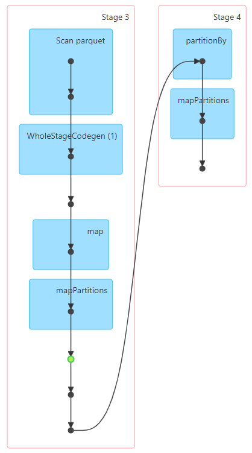
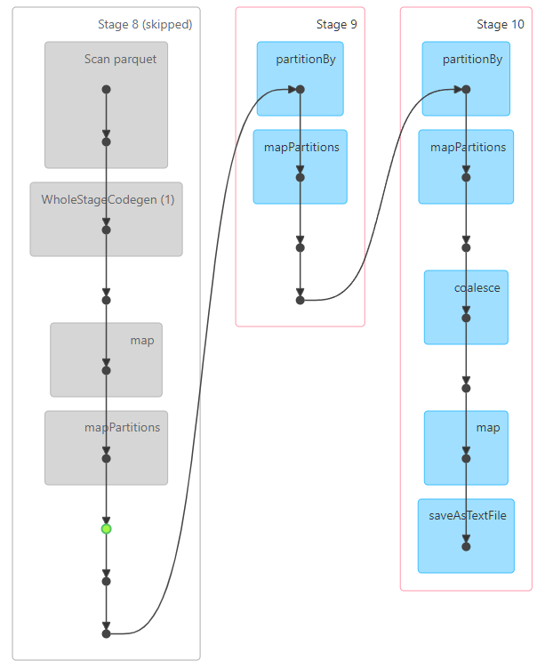

# W5M1 Report

## Feature Engineering

- Data Loading
  - spark.read.parquet(FILE_NAME)를 사용하여 Parquet 파일을 DataFrame으로 로드한 후, .rdd를 호출하여 RDD로 변환. 데이터의 1%만 샘플링하여 처리량을 줄임.
- Data Cleaning
  - filter 변환을 사용하여 request_datetime이 2024년이고, request_datetime의 월이 1이며, base_passenger_fare가 0보다 큰(유효한) 행만 남김.
- Transformation Logic
  - map 변환을 사용하여 필요한 컬럼만 추출, reduce 및 reduceByKey 변환을 사용하여 데이터를 집계.
- Aggregation Logic
  - reduce 액션을 사용하여 총 수익과 총 트립 수를 계산, reduceByKey와 sortByKey를 조합하여 일별 트립 수와 총 수익을 집계.
- Performance Optimization
  - filtered_rdd.cache()를 사용하여 filtered_rdd가 여러 액션(total_revenue_count 및 daily_metrics_rdd 계산)에서 재사용될 때 불필요한 재계산을 방지.
- Result Storage
  - coalesce(1).saveAsTextFile() 액션을 사용하여 계산된 요약 및 일별 지표 결과를 단일 CSV 파일로 로컬 파일 시스템에 저장.

## DAG visualization

        

- 저장하는 과정에 Skipped 스테이지가 있는 이유:
  - DAG의 마지막 단계에서 coalesce(1).saveAsTextFile() 액션을 수행하는 과정에서 Spark는 이미 계산된 셔플 데이터를 재사용하여 "Skipped"로 표시된 스테이지가 있음.
