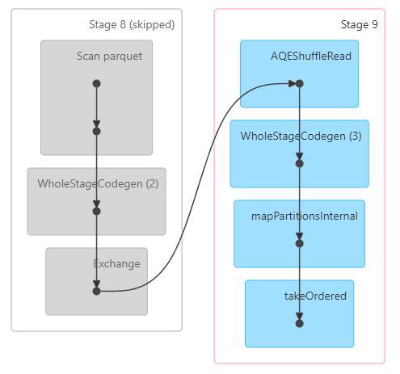

# W5M2 Report

## Feature Engineering

- Read the Data: spark.read.parquet() 및 spark.read.csv() 사용.
- Data Cleaning and Preprocessing: filter(), regexp_replace(), cast(), make_date() 등 사용.
- Transformations: select(), filter(), withColumn(), join(), groupBy(), agg(), round(), floor() 등의 함수 사용.
- Actions: show() 액션 사용.
- Optimize DAG: df_with_day.cache() 사용.
  - 실행 시간을 확인해봤지만 데이터 셋의 크기 때문인지 성능적인 향상은 잘 확인되지 않았음.

## DAG visualization

- Skipped Stage
  - Spark는 셔플(Shuffle)이 발생하는 스테이지의 결과 데이터를 임시적으로 저장. 이는 셔플이 비용이 많이 드는 작업이기 때문에, 같은 셔플 결과가 필요한 다음 Job이나 Stage에서 이 데이터를 재사용할 수 있도록 하기 위함.
  - 만약 동일한 셔플 결과가 필요한 다른 작업이 이어서 실행될 경우, Spark는 이전에 계산되어 임시 저장된 셔플 데이터를 재사용하고 관련 스테이지를 "Skipped"로 표시. 하지만 이 데이터는 메모리 부족 시 LRU (Least Recently Used) 전략에 따라 제거될 수 있음.

## DAG Stage

- AQEShuffleRead
  - AQE (Adaptive Query Execution)는 Spark 3.0 이상에서 도입된 기능으로, 런타임에 쿼리 실행 계획을 동적으로 조정하여 성능을 향상.

  - AQEShuffleRead는 이 스테이지가 이전 스테이지에서 셔플(Shuffle)된 데이터를 읽어오고 있음을 의미. 셔플은 데이터가 네트워크를 통해 재분배되는 비용이 많이 드는 작업이며, AQE는 셔플 파티션 수를 동적으로 조정하는 등의 최적화를 수행할 수 있음.

- WholeStageCodegen (3)

  - Whole-Stage Code Generation은 Spark SQL의 핵심 최적화 기법 중 하나. 여러 개의 물리적 연산자(예: 필터, 맵, 집계 등)를 하나의 함수로 컴파일하여 JVM 오버헤드를 줄이고 CPU 효율성을 극대화.

  - (3)은 이 스테이지에서 3개의 코드 생성 블록이 병합되어 실행되고 있음을 의미. 이는 Spark가 이 스테이지의 상당 부분을 하나의 효율적인 코드로 컴파일하여 실행하고 있음을 나타냄.

- mapPartitionsInternal

  - RDD의 mapPartitions 변환에 해당하는 내부 연산. 이는 각 파티션의 데이터를 개별적으로 처리하는 로직이 이 스테이지에 포함되어 있음을 보여줌. mapPartitions는 RDD의 각 파티션에 대해 함수를 한 번만 적용하므로, map보다 더 효율적일 수 있음 (예: 파티션별로 데이터베이스 연결을 설정할 때).

- takeOrdered

  - 이는 Spark 액션 중 하나인 takeOrdered에 해당하는 연산. takeOrdered(n)는 RDD나 DataFrame에서 주어진 순서에 따라 n개의 요소를 반환하는 액션. 일반적으로 이 작업은 데이터를 수집하고 정렬하는 과정이 포함되므로, 상당한 셔플이나 계산이 필요할 수 있음. 이 액션이 Job을 트리거했을 가능성이 높음.